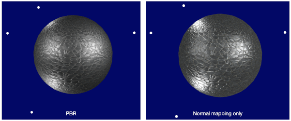

# Physically based rendering (PBR)

Brings more physical principles into rendering.

Based on Microfacet theory and Phong shading model.
When computing the diffuse and specular components for a fragment,
use a weighting function (BRDF) to evaluate the contribution of a certain light source.
Sum up all those contributions to obtain the final color of the fragment.

# Result

With direct light (e.g. point, directional and spotlight)

# Reference
[LearnOpenGL: PBR](https://learnopengl.com/PBR/Theory)

[LearnOpenGL: Normal Mapping](https://learnopengl.com/Advanced-Lighting/Normal-Mapping)

[LearnOpenGL sample code: PBR](https://github.com/JoeyDeVries/LearnOpenGL/tree/master/src/6.pbr)
